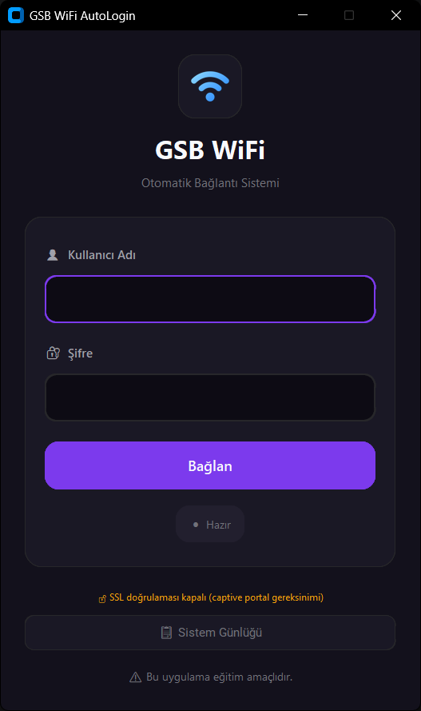

# GSB WiFi Auto Login

<p>
  
  <a href="https://github.com/Toxpox/GSB-WiFi-AutoLogin/blob/main/LICENSE" target="_blank">
  
  </a>
  
</p>

Bu uygulama, KYK yurtlarında kullanılan GSB WiFi ağına otomatik giriş yapılmasını sağlayan modern bir masaüstü uygulamasıdır. Yeni arayüzü ile kota bilgilerinizi, son giriş zamanınızı ve kullanıcı bilgilerinizi kolayca takip edebilirsiniz.

### 🏠 [Anasayfa](https://github.com/Toxpox/GSB-WiFi-AutoLogin)

## ⚠️ Güvenlik Uyarısı

Bu uygulama, yalnızca GSB/KYK captive portalı için tasarlanmıştır. Kimlik bilgileriniz **sadece kendi bilgisayarınızda** `user_config.json` dosyasında saklanır ve dışarıya aktarılmaz. Uygulamayı güvenilir olmayan kaynaklardan indirmeyiniz.

## 📸 Ekran Görüntüsü

<div align="center">

</div>

## ✨ Özellikler

- **Modern Arayüz:** PyQt6 ile geliştirilmiş şık ve kullanıcı dostu tasarım.
- **Otomatik Giriş:** Kullanıcı adınızı kaydederek giriş yapın.
- **Dashboard Ekranı:**
  - Kalan kota bilgisi
  - Son giriş zamanı
  - Kullanıcı adı görüntüleme
- **Hızlı İşlem:** Arka planda çalışan optimize edilmiş giriş algoritması.
- **Taşınabilir (Portable):** Kurulum gerektirmeyen `.exe` formatı.

## 🚀 Kurulum ve Kullanım


1. [Releases](https://github.com/Toxpox/GSB-WiFi-AutoLogin/releases) sayfasından `GSB_AutoLogin.exe` dosyasını indirin.
2. Bilgisayarınızın GSB WiFi ağına bağlı olduğundan emin olun.
3. `GSB_AutoLogin.exe` dosyasını çalıştırın.
4. Kullanıcı adı ve şifrenizi girerek **Giriş Yap** butonuna tıklayın.


## 🛠️ Geliştirme ve Derleme

Projeyi kendiniz derlemek isterseniz `PyInstaller` kullanabilirsiniz:

```powershell
pyinstaller --noconsole --onefile --name="GSB_AutoLogin" gsb_autologin.py
```

## 📂 Proje Yapısı

```
GSB-WiFi-AutoLogin/
  0.9.2-beta/
    ├── gsb_autologin.py    # Ana uygulama mantığı ve pencere yönetimi
    ├── login_ui.py         # Giriş ekranı arayüz kodları (PyQt6)
    └── dashboard_ui.py     # Bilgi ekranı arayüz kodları (PyQt6)
├── user_config.json        # Kullanıcı ayarlarının saklandığı dosya (Otomatik oluşur)
├── LICENSE
├── README.md               # Proje dokümantasyonu
└── gsb-autologin-core.py   # WinUI için API
```

## 📝 Lisans

Copyright © 2025 [Toxpox](https://github.com/Toxpox). 
Bu proje [MIT License](https://github.com/Toxpox/GSB-WiFi-AutoLogin/blob/main/LICENSE) ile lisanslanmıştır.
