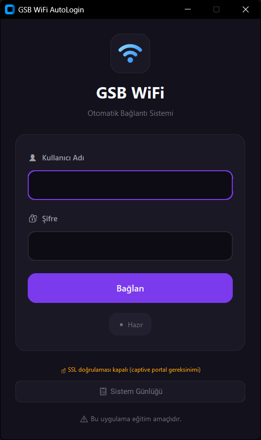

# GSB WiFi Auto Login

[](https://github.com/Toxpox/GSB-WiFi-AutoLogin/actions/workflows/ci.yml)
[](https://app.fossa.com/projects/git%2Bgithub.com%2FToxpox%2FGSB-WiFi-AutoLogin?ref=badge_shield)

<p>
  
  <a href="https://github.com/Toxpox/GSB-WiFi-AutoLogin/blob/main/LICENSE" target="_blank">
  
  </a>
  
  
</p>

KYK yurtlarında kullanılan GSB WiFi ağına otomatik giriş yapan modern masaüstü uygulaması. Dark tema arayüzü ile kullanıcı bilgilerinizi ve kota durumunuzu kolayca takip edebilirsiniz.

### [Anasayfa](https://github.com/Toxpox/GSB-WiFi-AutoLogin)

## Güvenlik Uyarısı

Bu uygulama, yalnızca GSB/KYK captive portalı için tasarlanmıştır. Kimlik bilgileriniz **sadece kendi bilgisayarınızda** `user_config.json` dosyasında saklanır ve dışarıya aktarılmaz. SSL doğrulaması captive portal gereksinimi nedeniyle devre dışıdır. Uygulamayı güvenilir olmayan kaynaklardan indirmeyiniz.

## Ekran Görüntüsü

<div align="center">

</div>

## Özellikler

- **Modern Arayüz:** CustomTkinter ile geliştirilmiş dark tema tasarım
- **Otomatik Giriş:** Kullanıcı adınızı kaydederek tek tıkla giriş yapın
- **Hoşgeldin Ekranı:** Başarılı girişten sonra kullanıcı bilgileri ve kota durumu
- **Kota Takibi:** Kalan kota, yüzde göstergesi ve yenilenme tarihi
- **Sistem Günlüğü:** Tüm işlemleri renkli log penceresiyle takip edin
- **Animasyonlu UI:** Durum göstergeleri ve focus efektleri
- **Oturum Yönetimi:** Güvenli çıkış yapma desteği
- **Yeniden Deneme:** Ağ hatalarında exponential backoff ile otomatik tekrar
- **Hata Yönetimi:** Özel hata sınıflarıyla kullanıcıya anlaşılır mesajlar

## Kurulum ve Kullanım

### Hazır Çalıştırılabilir

1. [Releases](https://github.com/Toxpox/GSB-WiFi-AutoLogin/releases) sayfasından `GSB_AutoLogin.exe` dosyasını indirin
2. Bilgisayarınızın GSB WiFi ağına bağlı olduğundan emin olun
3. `GSB_AutoLogin.exe` dosyasını çalıştırın
4. Kullanıcı adı ve şifrenizi girerek **Bağlan** butonuna tıklayın

### Python ile Çalıştırma

```powershell
git clone https://github.com/Toxpox/GSB-WiFi-AutoLogin.git
cd GSB-WiFi-AutoLogin
pip install -e .
python src/gsb-autologin.py
```

### Geliştirici Kurulumu

```powershell
pip install -e ".[dev]"
ruff check src/
mypy src/
```

## Proje Yapısı

```
GSB-WiFi-AutoLogin/
├── src/
│   ├── gsb-autologin.py     # Giriş noktası
│   ├── main.py              # Uygulama başlatıcı
│   ├── config.py            # Sabitler, renkler, versiyon, kullanıcı ayarları
│   ├── errors.py            # Özel hata sınıfları (GSBHata, AğHatası, vb.)
│   ├── network.py           # HTTP işlemleri, giriş/çıkış, retry mekanizması
│   ├── parser.py            # HTML ayrıştırıcı (TR/EN destek, kota bilgileri)
│   ├── ui/
│   │   ├── app.py           # Ana uygulama sınıfı, ekran yönetimi
│   │   ├── giris_ekrani.py  # Giriş formu ekranı
│   │   ├── hosgeldin_ekrani.py  # Başarılı giriş ekranı, kota kartı
│   │   ├── log_penceresi.py # Renkli log penceresi
│   │   └── widgets.py       # Özel UI bileşenleri
│   └── LoginPage.png        # Ekran görüntüsü
├── .github/workflows/
│   └── ci.yml               # CI: lint, format, tip kontrolü, build
├── pyproject.toml            # Proje metadata ve bağımlılıklar
├── GSB_AutoLogin.spec        # PyInstaller build spec
├── LICENSE
└── README.md
```

## Derleme

### PyInstaller ile Derleme

```powershell
pip install -e ".[dev]"
pyinstaller GSB_AutoLogin.spec
```

Çıktı: `dist/GSB_AutoLogin.exe`

### Nuitka ile Derleme

```powershell
pip install nuitka
python -m nuitka --standalone --onefile --enable-plugin=tk-inter --include-data-file=src/LoginPage.png=LoginPage.png --output-dir=buildtest --output-filename=GSB_AutoLogin_Nuitka.exe src/gsb-autologin.py
```

Çıktı: `buildtest/GSB_AutoLogin_Nuitka.exe`

> **Not:** Nuitka, C derleyicisi gerektirir (MSVC veya MinGW). Derleme süresi PyInstaller'a göre daha uzundur ancak daha küçük ve hızlı çalıştırılabilir dosya üretir.

## Teknolojiler

| Teknoloji | Kullanım |
|-----------|----------|
| **Python 3.10+** | Ana dil |
| **CustomTkinter** | Modern dark tema UI |
| **Requests** | HTTP işlemleri |
| **BeautifulSoup4** | Portal HTML ayrıştırma |
| **PyInstaller** | Windows exe derleme |
| **Nuitka** | Optimize edilmiş Windows exe derleme |
| **ruff** | Lint ve format |
| **mypy** | Statik tip kontrolü |
| **GitHub Actions** | CI/CD pipeline |

## SSS

**Uygulama "Giriş Başarısız" diyor.**
Kullanıcı adı (TC Kimlik No) ve şifrenizi kontrol edin. GSB WiFi ağına bağlı olduğunuzdan emin olun.

**Antivirüs uyarısı veriyor.**
PyInstaller/Nuitka ile derlenmiş uygulamalar bazı antivirüslerde false positive oluşturabilir. Kaynak kodu açıktır, kendiniz derleyebilirsiniz.

**Kota bilgileri görünmüyor.**
Kota bilgileri portal tarafından sağlanan HTML'den çekilir. Bazı durumlarda portal bu bilgileri geç yükleyebilir.

## Lisans

Copyright 2025 [Toxpox](https://github.com/Toxpox).
Bu proje [GNU General Public License v3.0 (GPLv3)](https://github.com/Toxpox/GSB-WiFi-AutoLogin/blob/main/LICENSE) ile lisanslanmıştır.

[](https://app.fossa.com/projects/git%2Bgithub.com%2FToxpox%2FGSB-WiFi-AutoLogin?ref=badge_large)
