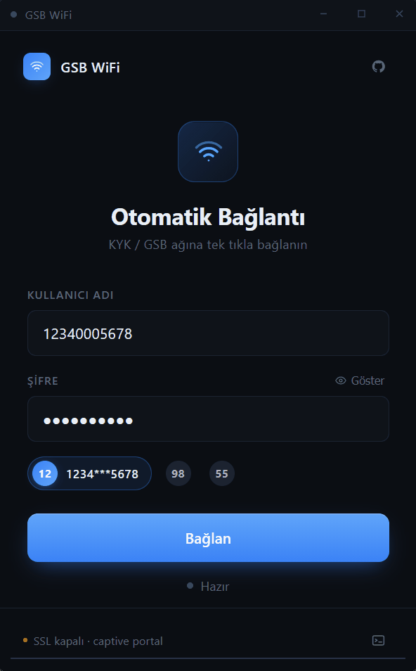

<div align="center">

# 🛜 GSB WiFi AutoLogin

[](https://app.fossa.com/projects/git%2Bgithub.com%2FToxpox%2FGSB-WiFi-AutoLogin?ref=badge_shield&issueType=security)
[](https://app.fossa.com/projects/git%2Bgithub.com%2FToxpox%2FGSB-WiFi-AutoLogin?ref=badge_shield&issueType=license)

<p align="center">
  
  <a href="https://github.com/Toxpox/GSB-WiFi-AutoLogin/blob/main/LICENSE" target="_blank">
    
  </a>
  
  
</p>

**KYK yurtlarında kullanılan GSB WiFi ağına otomatik giriş yapan modern masaüstü uygulaması.**  
*Rust + Tauri v2 ile geliştirilmiştir.*

</div>

---
## Preview

<p align="center">
  
</p>

## ✨ Özellikler

- ⚡ **Otomatik Giriş:** Uygulama açılışında kayıtlı profille kendiliğinden bağlanma; tek tıkla manuel giriş her zaman mümkün.
- 🖥️ **Sistem Tepsisi:** Pencere kapatılınca tepsiye küçülme; tepsi menüsünden Bağlan / Çıkış Yap / Pencereyi Göster; bağlantı durumu tepsi ipucunda.
- 🚀 **Başlangıçta Çalışma:** Windows açılışında sessizce (pencere açmadan, tepsiden) başlama seçeneği.
- 🔁 **Otomatik Yeniden Bağlanma:** Periyodik oturum canlılık kontrolü; oturum düştüyse son kimlik bilgileriyle kendiliğinden yeniden giriş.
- 📡 **GSB Ağı Algılama:** GSB ağında değilken uyarı; gereksiz giriş denemeleri yapılmaz.
- 🆕 **Otomatik Güncelleme:** Açılışta arka planda sürüm kontrolü; güncelleme varsa pencerenin üstünde yeşil bir bar belirir, tek tıkla imzalı güncelleme indirilip kurulur ve uygulama yeniden başlar (installer sürümünde; portable'da indirme sayfası açılır).
- 🔔 **Kota Bildirimleri:** Kota %20'nin altına düşünce veya dolunca Windows bildirimi; bağlantı koptuğunda da haber verir.
- 📊 **Kota Takibi:** Kalan kota, yüzde göstergesi, kullanılan kota ve yenilenme tarihi.
- 👥 **Çoklu Profil:** Birden fazla hesabı yerelde kaydetme, takma ad verme, seçme ve silme.
- ⚙️ **Ayarlar Paneli:** Otomatik giriş, tepsiye küçülme, başlangıçta çalışma, yeniden bağlanma ve bildirimler için kalıcı anahtarlar.
- 📜 **Sistem Günlüğü:** Tüm adımlar log panelinde ve `logs/uygulama.log` dosyasında (otomatik rotasyonlu); "Klasörü Aç" ile erişim.
- 🔒 **Şifreleme:** Kullanıcı bilgilerini `user_config.json` içinde AES-GCM ile şifreli saklama.
- 🚪 **Oturum Yönetimi:** Aktif oturumu sonlandırma ve maksimum cihaz durumunda önceki oturumu düşürme.
- 🔄 **Yeniden Deneme:** Ağ hatalarında exponential backoff ile kontrollü tekrar deneme.
- 🎨 **Modern Arayüz:** Koyu tema, kompakt giriş ekranı ve akıcı ekran geçişleri.

---

## 📥 İndirme

En güncel sürümü **[Releases](https://github.com/Toxpox/GSB-WiFi-AutoLogin/releases)** sayfasından indirebilirsiniz.

Uygulama açılışta yeni sürümü arka planda kontrol eder. Güncelleme varsa pencerenin üstünde yeşil bir bar belirir: installer (NSIS) kurulumunda tek tıkla imzalı güncelleme indirilir, kurulur ve uygulama yeniden başlar; portable sürümde bar GitHub release sayfasını açar.

> ℹ️ Otomatik güncelleme v1.8.0 ile geldi: v1.8.0'ı bir kez elle kurmanız gerekir, sonraki sürümler uygulama içinden güncellenir.

### 📦 Installer vs 🚀 Portable

| Özellik | 📦 Installer (`.exe` setup) | 🚀 Portable (`.exe`) |
|:---|:---|:---|
| **Kurulum** | Klasik kurulum sihirbazı ile sisteminize kurulur. | Kurulum gerektirmez, indirip doğrudan çalıştırın. |
| **Konum** | `AppData\Local` dizini altına yerleşir. | Herhangi bir klasörden veya USB bellekten çalışır. |
| **Başlat Menüsü** | Kısayol oluşturur, kolay erişim sağlar. | Kısayol oluşturmaz, bağımsızdır. |
| **Kaldırma** | Windows "Program Ekle/Kaldır" menüsünden kaldırılır. | Sadece dosyayı silmek yeterlidir. |
| **Güncelleme** | Uygulama içinden otomatik (yeşil güncelleme barı). | Eski dosya silinip yenisi ile değiştirilir. |
| **Başlangıçta çalışma** | Desteklenir. | Desteklenir (exe taşınırsa kayıt yeniden yapılmalı). |

> 💡 **Not:** Her iki sürüm de aynı uygulama mantığını kullanır. Kullanım alışkanlığınıza göre tercih yapabilirsiniz.

---

## ⚠️ Güvenlik Uyarısı

Bu uygulama **yalnızca GSB/KYK captive portali** için tasarlanmıştır.

Kimlik bilgileriniz sadece kendi bilgisayarınızda saklanır. Kayıtlı profiller `user_config.json` içinde, cihaza özgü bir anahtarla (makine adı + işletim sistemi kullanıcı adından türetilir) AES-GCM kullanılarak şifrelenir ve hiçbir dış sunucuya gönderilmez. GitHub sürüm kontrolü yalnızca release bilgisi almak için GitHub API'ye istek atar; kullanıcı adı, şifre veya profil bilgisi bu isteğe eklenmez.

Giriş istekleri backend tarafında doğrulanır ve yalnızca `wifi.gsb.gov.tr` adresine gönderilebilir; kimlik bilgilerinin başka bir adrese iletilmesi mümkün değildir.

SSL doğrulaması, GSB captive portal akışının yönlendirme gereksinimleri nedeniyle portal istemcisinde devre dışıdır. GitHub sürüm kontrolü ise ayrı ve normal TLS doğrulamalı HTTP istemcisiyle yapılır.

Otomatik güncellemeler kriptografik olarak imzalıdır (minisign): uygulama yalnızca gömülü genel anahtarla doğrulanan güncellemeleri kurar; imzasız veya değiştirilmiş bir paket kurulmaz.

---

## 🛠️ Geliştirme

Projeyi kendi bilgisayarınızda derlemek veya geliştirmek için:

### Gereksinimler

- [Rust](https://rustup.rs/) stable sürüm
- [Node.js](https://nodejs.org/) opsiyonel, frontend sözdizimi kontrolleri için
- Windows 10 veya Windows 11
- Tauri CLI (`cargo install tauri-cli --version "^2"` veya mevcut eşdeğer kurulum)

### Derleme Adımları

```powershell
# Depoyu klonlayın
git clone https://github.com/Toxpox/GSB-WiFi-AutoLogin.git

# Proje dizinine geçin
cd GSB-WiFi-AutoLogin/src-tauri

# Uygulamayı derleyin
cargo tauri build
```

📂 **Çıktı Yolları:**

- **Installer:** `src-tauri/target/release/bundle/nsis/`
- **Portable exe:** `src-tauri/target/release/`

### Kontrol Komutları

```powershell
cd src-tauri
cargo fmt --check
cargo test
cargo clippy -- -D warnings
```

Frontend sözdizimi için:

```powershell
node --check frontend/js/app.js
node --check frontend/js/giris.js
node --check frontend/js/log.js
node --check frontend/js/hosgeldin.js
```

---

## 💻 Teknolojiler

| Teknoloji | Kullanım Alanı |
|:---:|:---|
|  | Backend mantığı, ağ akışı, profil yönetimi ve şifreleme |
|  | Windows masaüstü uygulama çerçevesi |
|  | Etkileşimli frontend arayüzü |
| **AES-GCM** | Yerel kullanıcı bilgisi şifreleme |
| **reqwest** | Captive portal, çıkış işlemi ve GitHub Releases API istekleri |
| **GitHub Releases API** | Yeni sürüm kontrolü ve otomatik güncelleme dağıtımı |
| **tauri-plugin-updater** | İmzalı uygulama içi otomatik güncelleme |

---

## 📝 Sürüm Geçmişi

Tüm değişiklikler için **[CHANGELOG.md](CHANGELOG.md)** dosyasına bakabilirsiniz.

---

## 📄 Lisans

Copyright © 2025 **[Toxpox](https://github.com/Toxpox)**.  
Bu proje **[GNU General Public License v3.0 (GPLv3)](https://github.com/Toxpox/GSB-WiFi-AutoLogin/blob/main/LICENSE)** ile lisanslanmıştır. Detaylar için `LICENSE` dosyasına göz atabilirsiniz.
